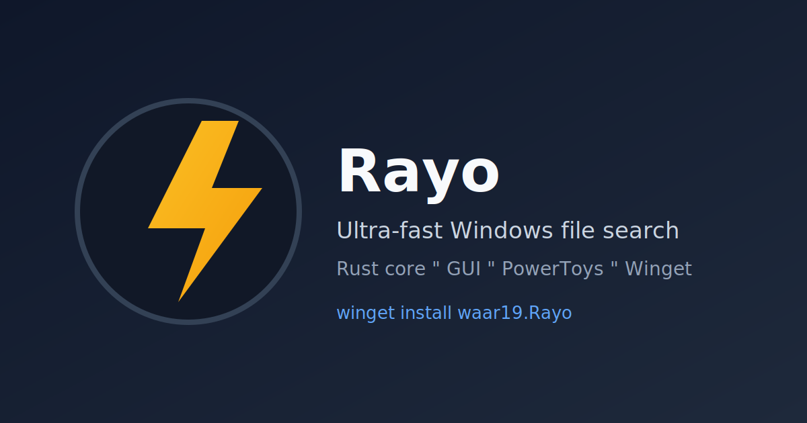

# Rayo

Ultra-fast file search engine for Windows, written in Rust and inspired by Everything.

English | [Español](README.es.md)


## What Rayo does today (MVP)

- Enumerates NTFS MFT using `FSCTL_ENUM_USN_DATA`.
- Builds and persists a file index keyed by FRN.
- Reconstructs full paths by walking parent FRNs.
- Searches by substring with filters:
  - `--ext`
  - `--under`
  - `--exclude`
  - `--glob`
  - `--dirs-only`
  - `--files-only`
  - `--limit`
- Applies live updates from USN Journal (`FSCTL_READ_USN_JOURNAL`).
- Uses zstd-compressed index persistence (legacy uncompressed files still load).
- Falls back to a filesystem walker on non-NTFS fixed drives.

## Project structure

- `crates/rayo-core`: indexing, search, NTFS/USN integration, persistence.
- `crates/rayo-cli`: CLI interface (`index`, `search`, `content`, `watch`).
- `crates/rayo-service`: elevated background service with live in-memory index, content search, and named pipe API.
- `crates/rayo-gui`: native desktop GUI (`Slint`, Fluent style) with service/fallback search, content mode, fuzzy mode, app search, theme auto toggle, icons, hotkey, and preview panel.

## Requirements

- Windows (NTFS volume).
- Rust toolchain (`cargo`).
- Administrator privileges for `index` and `watch` (needed to read MFT/USN).

## Install

Primary install path:

```powershell
winget install waar19.Rayo
```

Upgrade:

```powershell
winget upgrade waar19.Rayo
```

Alternative installer:

- Download `RayoSetup.exe` from [Releases](https://github.com/waar19/rayo/releases/latest).

## Demo

Preview image:



Demo capture checklist:

- [`docs/demo-recording-checklist.md`](docs/demo-recording-checklist.md)

## Quick start

```powershell
# Build
cargo build

# Create index (run terminal as Administrator)
# Single drive:
cargo run -p rayo-cli -- index --drive C --output .\c.rayo
# Multi-drive (generates c.rayo, d.rayo from base output path):
cargo run -p rayo-cli -- index --drive C,D --output .\c.rayo

# Search
cargo run -p rayo-cli -- search --index .\c.rayo --query report --ext pdf
# Fuzzy ranking
cargo run -p rayo-cli -- search --index .\c.rayo --query rpt --fuzzy

# Content search (regex, ripgrep-style)
cargo run -p rayo-cli -- content --query "Rayo GUI search client" --under . --limit 20

# Syntax-aware search (tree-sitter)
cargo run -p rayo-cli -- syntax --query "hello_world" --under .\crates --language rust --node-kind function_item

# Keep index updated (run terminal as Administrator)
cargo run -p rayo-cli -- watch --drive C --index .\c.rayo --exclude "C:\Windows,C:\Program Files"

# Start background service (run terminal as Administrator)
# Auto-detect fixed drives:
cargo run -p rayo-service -- --drives auto --index .\index.rayo
# Multi-drive merge:
cargo run -p rayo-service -- --drives C,D --index .\c.rayo

# Open GUI (tries service first, falls back to local index file)
cargo run -p rayo-gui -- --index .\c.rayo

# Optional: install Explorer context menus for file/folder/background
cargo run -p rayo-cli -- shell install --gui-path .\target\debug\rayo-gui.exe

# Diagnose shell integration
cargo run -p rayo-cli -- shell doctor --gui-path .\target\debug\rayo-gui.exe
```

### GUI actions

- Select a row, then use action buttons: `Open`, `Open as admin`, `Open folder`, `Copy path`.
- Built-in Settings panel lets you tune scope, extension, name/content mode, fuzzy mode, result limit, and debounce.
- Keyboard shortcuts: `Ctrl+,` opens Settings and `Esc` closes Settings.
- Global hotkey: `Ctrl+Alt+Space` focuses Rayo window.
- Empty or 1-character queries do not run full search unless `--under` is set.
- Right-click on result row opens contextual action menu.

### Why Rayo (short comparison)

- Vs Windows Search: Rayo focuses raw speed and deterministic filters (`under`, `ext`, `exclude`).
- Vs Everything: Rayo adds built-in service + PowerToys plugin workflow in same project.
- Vs both: Rayo is fully open source, Rust-based, and scriptable by CLI/service.

### Contextual GUI launch flags

- `--under <path>`: open GUI scoped to a folder (used by Explorer directory actions).
- `--query <text>`: prefill the search box.
- `--open <path>`: derive context from a file/folder path for right-click workflows.

### Optional trigram mode

For long queries, trigram mode can reduce first-search latency dramatically:

```powershell
# CLI one-off
cargo run --release -p rayo-cli -- search --index .\c.rayo --query tickettrack --trigram

# Service-wide mode (for clients through named pipe, including multi-drive)
cargo run -p rayo-service -- --drives C,D --index .\c.rayo --trigram --metrics-interval-secs 30
```

Tradeoff: trigram index uses more memory, but improves long/rare query latency.

## Validation results (Windows 11, C:, Jul 2026)

Real-world validation on NTFS `C:` with elevated terminal:

- Index file size: ~`365 MB`.
- Entries loaded: ~`6.2M`.

Search latency samples on real index (release):

- `--query report --limit 20`: `20` results in `6.673 ms`.
- `--query report --limit 20 --trigram`: `20` results in `6.644 ms`.
- `--query tickettrack --limit 20`: `1` result in `7.685 ms`.
- `--query tickettrack --limit 20 --trigram`: `1` result in `0.502 ms`.
- `--query zzzqqxxnotfound --limit 20`: `0` results in `7.321 ms`.
- `--query zzzqqxxnotfound --limit 20 --trigram`: `0` results in `0.026 ms`.

Watch validation covered file create/rename/delete events.

Service + integration validation:

- `rayo-service` started elevated with existing index and exposed `\\.\pipe\rayo-query`.
- Non-elevated client query over named pipe returned JSON results successfully.
- `rayo-cli shell install`, `shell doctor`, and `shell uninstall` validated file/folder/background Explorer integration in `HKCU\Software\Classes`.

## Roadmap

### Completed

- GUI parity upgrade: per-row icons, installed app search, and system light/dark support with user toggle.
- Service/core efficiency upgrade: configurable `--exclude` prefixes in CLI/service, zstd index compression with retro-compatibility, and non-NTFS fallback indexer.
- PowerToys plugin settings: max results, content timeout, fuzzy mode, app search toggle, and base score in settings UI.

### Next

- GUI update banner with daily release check and one-click update link.
- Code-signing rollout (Trusted Signing) to reduce SmartScreen friction.
- Public launch package: demo media + distribution posts.

## CI and release packaging

- CI pipeline: [`.github/workflows/ci.yml`](.github/workflows/ci.yml) runs `fmt`, `test`, Windows release builds, and a non-blocking .NET build for the PowerToys plugin scaffold.
- Windows release helper: [`scripts/release-windows.ps1`](scripts/release-windows.ps1)

```powershell
pwsh .\scripts\release-windows.ps1
```

This generates `dist/rayo-windows.zip` with `rayo-cli.exe`, `rayo-service.exe`, `rayo-gui.exe`, and docs.

## PowerToys Run plugin

- Plugin project: [`integrations/powertoys-run`](integrations/powertoys-run)
- Action keyword: `ry` (global mode also available in PowerToys settings)
- Runtime dependency: `rayo-service` running as Administrator (`\\.\pipe\rayo-query`)

### Build and install manually

```powershell
dotnet build .\integrations\powertoys-run\Community.PowerToys.Run.Plugin.Rayo.csproj -c Release
dotnet publish .\integrations\powertoys-run\Community.PowerToys.Run.Plugin.Rayo.csproj -c Release -o .\dist\powertoys-run\RayoPlugin
```

Copy plugin output to:

`%LOCALAPPDATA%\Microsoft\PowerToys\PowerToys Run\Plugins\Rayo\`

Then restart PowerToys and search with:

`ry <query>`

Content mode from plugin:

`ry c <regex>`

Plugin also searches installed apps (Start Menu/WindowsApps) and shows default app icons when possible.

### Run as background service (recommended)

Use the new scheduled-task mode so Rayo runs without a visible console window:

```powershell
rayo-cli service install --service-exe "$env:LOCALAPPDATA\Rayo\rayo-service.exe" --drives C --exclude "C:\Windows,C:\Program Files"
rayo-cli service status
rayo-cli service uninstall
```

Defaults used by background mode:

- Index files: `%ProgramData%\Rayo\<drive>.rayo`
- Service log: `%ProgramData%\Rayo\service.log`

### Dependency-aware installer

One-command install from latest GitHub Release:

```powershell
irm https://raw.githubusercontent.com/waar19/rayo/main/scripts/install-powertoys-plugin.ps1 | iex
```

Local install with explicit zip:

```powershell
pwsh .\scripts\install-powertoys-plugin.ps1 -PluginZipPath .\dist\powertoys-run\RayoPlugin.zip -AutoInstallDependencies -RestartPowerToys
```

What it does:
- Detects PowerToys.
- Installs plugin to `%LOCALAPPDATA%\Microsoft\PowerToys\PowerToys Run\Plugins\Rayo\`.
- Installs `rayo-service.exe`, `rayo-cli.exe`, and `rayo-gui.exe` to `%LOCALAPPDATA%\Rayo\`.
- Creates Start menu shortcut `Rayo` for launching the GUI.
- Registers/starts scheduled task `Rayo Service` for true background startup.
- Supports `RAYO_SERVICE_PATH` as override for custom service location.

### View indexing status

- Service log (live): `%ProgramData%\Rayo\service.log`
- PowerToys plugin shows startup/indexing progress while service warms up.
- GUI status bar shows source, indexed entries, request count, and average latency.

```powershell
Get-Content C:\ProgramData\Rayo\service.log -Tail 20 -Wait
```

### Uninstall plugin and service

One-command uninstall:

```powershell
irm https://raw.githubusercontent.com/waar19/rayo/main/scripts/uninstall-powertoys-plugin.ps1 | iex
```

By default, uninstall keeps existing indexes/logs in `%ProgramData%\Rayo`.
To remove all data too:

```powershell
pwsh .\scripts\uninstall-powertoys-plugin.ps1 -RemoveData $true
```

### Release assets

- Tag-based release workflow publishes:
  - `rayo-windows.zip`
  - `RayoPlugin.zip`
  - `RayoSetup.exe`
  - `rayo-winget-manifest-<version>.zip`
- Installer downloads `RayoPlugin.zip` from latest release automatically when `-PluginZipPath` is omitted.

Social preview image for repository cards:

- `assets/social-preview.svg`

Generate Winget manifest package locally:

```powershell
pwsh .\scripts\generate-winget-manifest.ps1 -Version 0.3.0 -InstallerUrl "https://github.com/waar19/rayo/releases/download/v0.3.0/rayo-windows.zip" -InstallerPath .\dist\rayo-windows.zip
```

### Troubleshooting PowerToys plugin init errors

If PowerToys shows plugin initialization errors for Rayo:

1. Make sure you are on the latest release (`v0.7.0` or newer).
2. Reinstall plugin:
   ```powershell
   irm https://raw.githubusercontent.com/waar19/rayo/main/scripts/install-powertoys-plugin.ps1 | iex
   ```
3. If it still fails, check logs:
   `%LOCALAPPDATA%\Microsoft\PowerToys\PowerToys Run\Logs\<version>\<date>.txt`
4. Search for:
   `Can't find class implement IPlugin` or `System.Runtime` load errors.

5. If logs mention `IPlugin` type mismatch, your plugin package likely bundled host DLLs (`Wox.Plugin.dll` / `PowerToys.*.dll`). Reinstall from latest release.

## License

[MIT](LICENSE)
